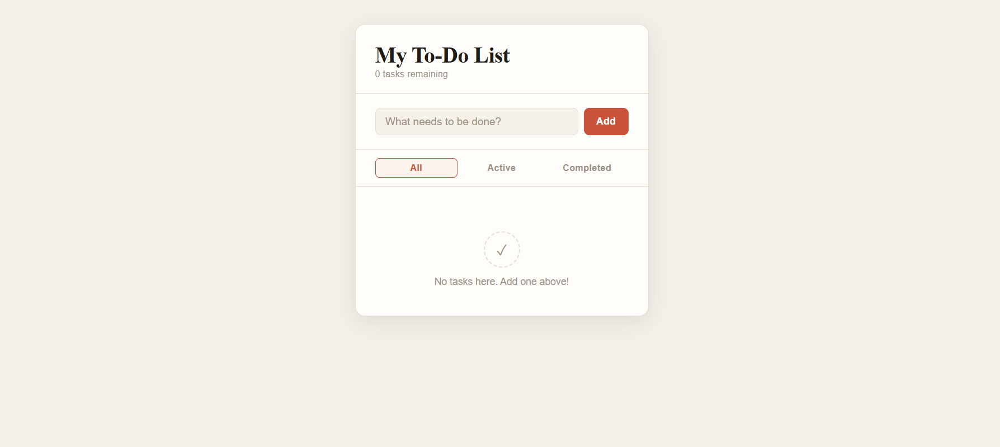

# ✅ To-Do App

A clean, fully functional to-do list app built with vanilla HTML, CSS, and JavaScript — no frameworks, no dependencies.

## 🔗 Live Demo

> [GitHub Pages link ](https://regis-chifambaa.github.io/todo-app/)

## 📸 Preview



---

## ✨ Features

- ➕ Add tasks with the **Add button** or by pressing **Enter**
- ✅ Mark tasks complete with a single click
- 🗑️ Delete individual tasks
- 🔍 Filter by **All**, **Active**, or **Completed**
- 🧹 **Clear Completed** to remove finished tasks in bulk
- 💾 Tasks saved to **localStorage** — persist across page reloads
- 📊 Live task counter showing remaining items
- 📱 Responsive design — works on mobile and desktop

---

## 🛠️ Tech Stack

| Layer      | Technology        |
|------------|-------------------|
| Structure  | HTML5             |
| Styling    | CSS3 (no library) |
| Logic      | Vanilla JavaScript (ES6+) |
| Storage    | Browser localStorage |

---

## 🚀 Getting Started

No installation needed. Just open the file in your browser:

```bash
git clone https://github.com/regis-chifambaa/todo-app.git
cd todo-app
open index.html   # or double-click in your file explorer
```

---

## 📁 Project Structure

```
todo-app/
├── index.html   # App structure
├── style.css    # All styling
├── script.js    # App logic & localStorage
└── README.md    # You're reading it
```

---

## 💡 What I Learned

- DOM manipulation without a framework
- Managing state with `localStorage`
- Separating UI logic from data logic
- Writing clean, reusable functions
- Filtering and rendering lists dynamically

---

## 🔮 Possible Future Improvements

- [ ] Drag-and-drop to reorder tasks
- [ ] Due dates and priority levels
- [ ] Dark mode toggle
- [ ] Sync to a backend / database

---

## 👤 Author

**Regis Tanaka Chifamba**
- GitHub: [@regis-chifambaa](https://github.com/regis-chifambaa)

---

*Built as Project #2 in my web development journey.*
